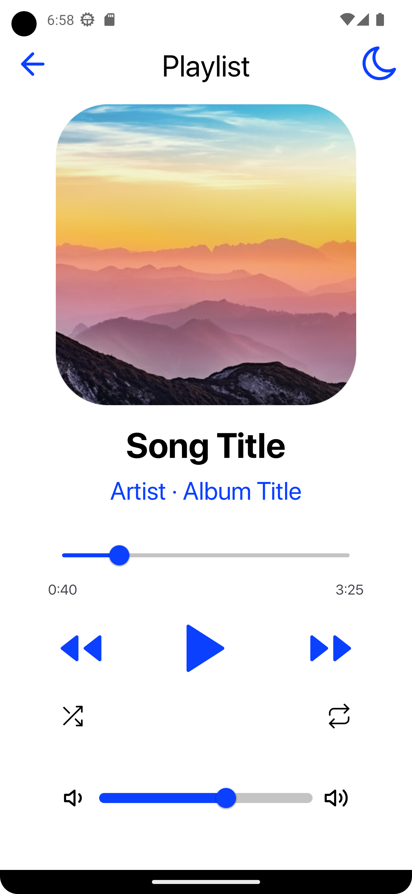
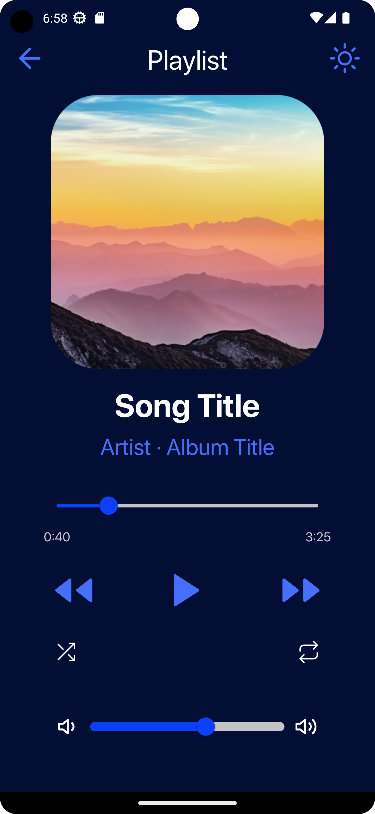

# GDSC TASK

## Table of Contents
- [Screenshots](#screenshots)
- [Demo](#demo)
- [Features](#features)

## Screenshots

<table>
  <tr>
    <td align="center">
      
       
      Light Mode
    </td>
    <td align="center">
      
       
      Dark Mode
    </td>
  </tr>
</table>

## Demo

## Features
Used SharedPreferences to store the last mode (dark or light) that was selected by the user before closing the app
